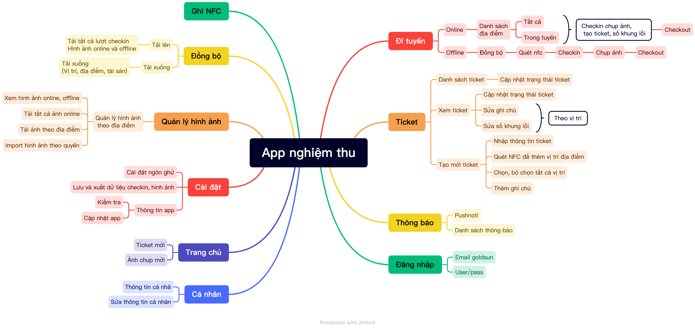

---
layout: default
title: App nghiệm thu
nav_order: 1
--- 

# App nghiệm thu

## Tổng quan

## Danh sách tính năng

### 1. Định nghĩa các từ viết tắt

**CRUD:** Thêm sửa xóa dữ liệu có áp dụng phân quyền theo chức năng và phân quyền theo dữ liệu

**IE:** Import, Export dữ liệu có áp dụng phân quyền theo chức năng và phân quyền theo dữ liệu

**A:** Approve/Reject các phiếu đề nghị, bao gồm thiết lập luồng phê duyệt, các trang quản lý đặc biệt (Tôi tạo, Đang duyệt, Đã duyệt, Hoàn thành)

**S:** Đồng bộ dữ liệu từ hệ thống khác

**O:** Other, các chức năng khác

**Man-day:** khối lượng công việc = số người làm * số ngày làm

Mỗi công việc sẽ bao gồm có: BA viết tài liệu + Design màn hình + Code FE + Code BE + Code Mobile (optional) + Tester

### 2. Bảng danh sách công việc

| STT             | Tính năng                      | Chức năng | Mô tả                   | Man-day |
|-----------------|--------------------------------|-----------|-------------------------|---------|
| A               | Quản lý tài khoản và đăng nhập |           |                         | 16      |
| A.1             | Đăng nhập                      | O         |                         | 10      |
| A.2             | Profile                        | O         | Chỉ có xem              | 6       |
| B               | Đi tuyến                       |           |                         | 26      |
| B.1             | Bản đồ khu vực                 | O         |                         | 10      |
| B.2             | Bản đồ tuyến phụ trách         | O         |                         | 12      |
| B.3             | Danh sách thiết bị trong tuyến | O         |                         | 4       |
| C               | Check in vị trí                |           |                         | 35      |
| C.1             | Checkin, Checkout vị trí       | O         |                         | 10      |
| C.2             | Quét thiết bị NFC              | O         |                         | 10      |
| C.3             | Chụp hình thực tế              | CRUD      |                         | 10      |
| C.4             | Ghi nhận sự cố trực tiếp       | CRUD      |                         | 5       |
| D               | Ghi nhận sự cố                 |           |                         | 20      |
| D.1             | Danh sách sự cố                | O         |                         | 3       |
| D.2             | Tạo mới sự cố                  | CRUD      |                         | 6       |
| D.3             | Bình luận                      | CRUD      |                         | 6       |
| D.4             | Tạo ticket xử lý sự cố         | CRUD      |                         | 5       |
| E               | Ticket của tôi                 |           |                         | 25      |
| E.1             | Tạo ticket mới                 | CRUD      |                         | 10      |
| E.2             | Ticket tôi tạo                 | O         |                         | 5       |
| E.3             | Ticket tôi xử lý               | O         |                         | 5       |
| E.4             | Bình luận                      | CRUD      |                         | 5       |
| F               | Thông báo                      |           |                         | 19      |
| F.1             | Thông báo trạng thái ticket    | O         | Tạo mới, cập nhật, đóng | 3       |
| Trạng thái đóng | 3                              |           |                         |         |
| F.2             | Thông báo bình luận về ticket  | O         |                         | 2       |
| F.3             | Thông báo sự cố                | O         |                         | 2       |
| F.4             | Thông báo bình luận sự cố      | O         |                         | 2       |
| F.5             | Thông báo chung từ hệ thống    | O         |                         | 5       |
|                 | Sum                            |           |                         | 141     |

### 3. Danh sách tài liệu chuyển giao

1. Tài liệu phân tích và thiết kế hệ thống (Word + Figma)
2. Tài liệu thiết kế hệ thống (chuyển giao lại cho phòng công nghệ)
3. Tài liệu hướng dẫn sử dụng (đính kèm trên giao diện phần mềm)
 
## Đăng nhập

### Đăng nhập thường

### Đăng nhập gmail

## Đi tuyến

The content for the header 2 intro goes here.

### Offline

### Online

## Ticket

### NFC

### Đọc

### Ghi
